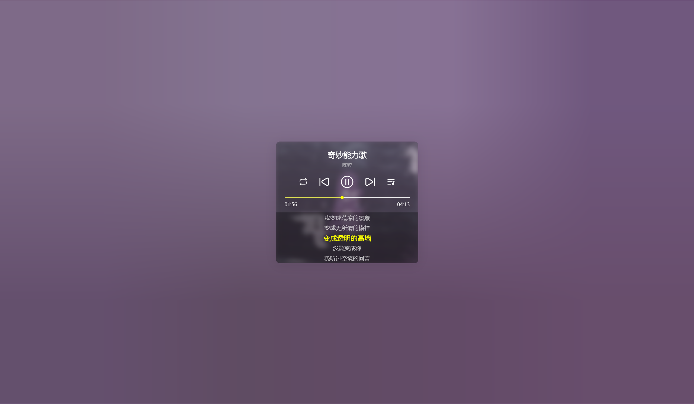

# 一个音乐播放组件




> 说明：对接后端音乐接口参见项目 [GoAPI](https://github.com/ztyangt/GoAPI)

# 使用方法

在`assets/config.js`中填写自己的歌单信息即可：

```javascript
window.musicList = [
  { "id": "7194189470", "type": "netease" },
  { "id": "2250011882", "type": "netease" },
  { "id": "8525990855", "type": "tencent" },
  { "id": "2370564757", "type": "tencent" },
  { "id": "8231706798", "type": "tencent" },
  { "id": "7950589030d", "type": "tencent" },
  { "id": "7869929506", "type": "netease" },
  { "id": "651304456", "type": "netease" },
  { "id": "2042006896", "type": "netease" },
  { "id": "7503418962", "type": "netease" },
  { "id": "7738405685", "type": "netease" },
  { "id": "71384707", "type": "netease" },
  { "id": "2873379741", "type": "netease" },
  { "id": "7500403051", "type": "netease" }
]
```

参数详解: 
- id: 歌曲id
- type: 厂商标识(QQ音乐：tencent | 网易云：netease)

> 目前仅支持 QQ音乐，网易云音乐